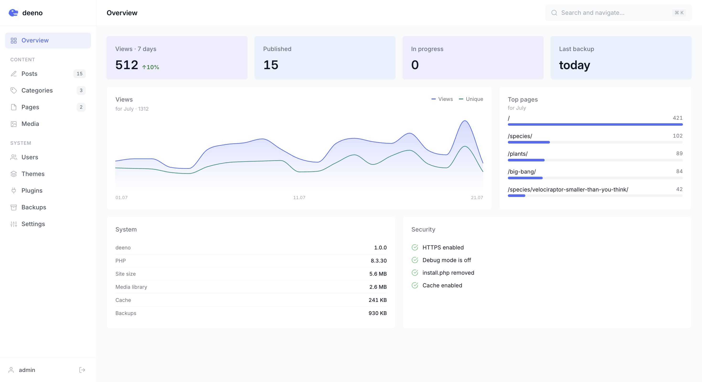

  

  
  
  
  

<h3 align="center">A simple system, simple for everyone.</h3>

**deeno** is a website in three steps. Upload the files, log in, and publish your
first post. No database, no setup rituals, no build tools — it runs on the cheapest
shared hosting you can find, and the whole thing is just files you own.

Write in a normal editor. Your content is plain text files, so nothing is ever
locked inside a database you can't reach.

## Why deeno

- **No database.** Nothing to create, configure, or back up separately.
- **Runs anywhere.** Any shared hosting with PHP 8.0+. Nothing to compile.
- **Yours, in plain files.** Content is Markdown, settings are plain files. Move it,
  copy it, edit it in Notepad — it's just files.
- **Everything included.** Editor, media library, SEO, RSS, search, dark mode,
  statistics, one-click backups, roles, themes and plugins — out of the box.
- **Fast by default.** Full-page cache, optimized images, no bloat.

## Get started

1. Upload the files to your host.
2. Open `https://your-site/install.php`.
3. Create your account — and publish.

That's it. The wizard checks everything for you and cleans up after itself.

## Screenshots

  

## Documentation

Full guides for using, theming and extending deeno live in
**[UserDoc/](UserDoc/)** — usage, themes, plugins and the changelog.

Building on deeno? Start with [UserDoc/USER-GUIDE.md](UserDoc/USER-GUIDE.md),
then [THEME.md](UserDoc/THEME.md) and [PLUGINS.md](UserDoc/PLUGINS.md).

## License

MIT — see [LICENSE](LICENSE). Do what you like with it.
